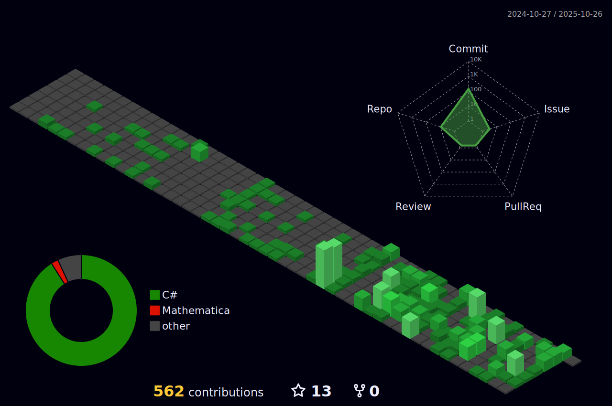

  <!--Header Part-->
  

  <!--Body Part-->
  
  ## 🻠About Me 
  #### 🙋‍♂️ I am a person who likes to make games 
  #### 🔥 I want to be a game programmer! 
  #### 💻 I like to design a new system  

  ## 
📠Contact Me 
  
 
  
  
          
 
    
  
 
    <h2 align="center">📧 Email 📧</h2>

  <Strong> wintiger0908@gmail.com </Strong>

 
   
   

  ## 🧮 Task Stack
  ### Languege
  <!--C#-->
   
  
  ### Stack
  <!--Unity-->
  
  <!--MongoDB-->
  
  <!--GitHub-->
  
  <!--Git-->
   

  ### Certification
  <!--START_SECTION:badges-->
  <!--END_SECTION:badges-->
  
  ### IDE
  <!--Visual Studio-->
  
  <!--Rider-->
  

  ## :bulb: GitHub Stats
   
  
  ## :bulb: BaekJoon Stats
  
  ## :bulb: GitHub Commits
  
  

